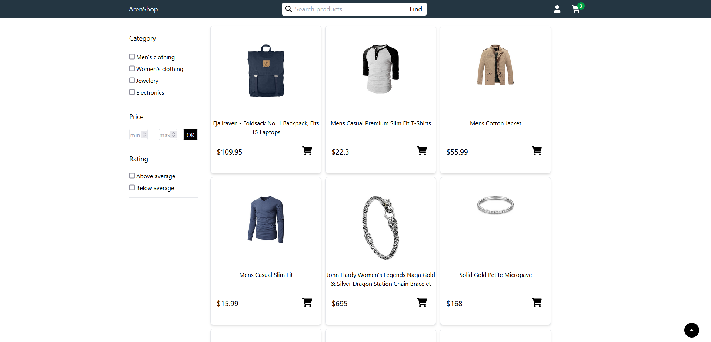
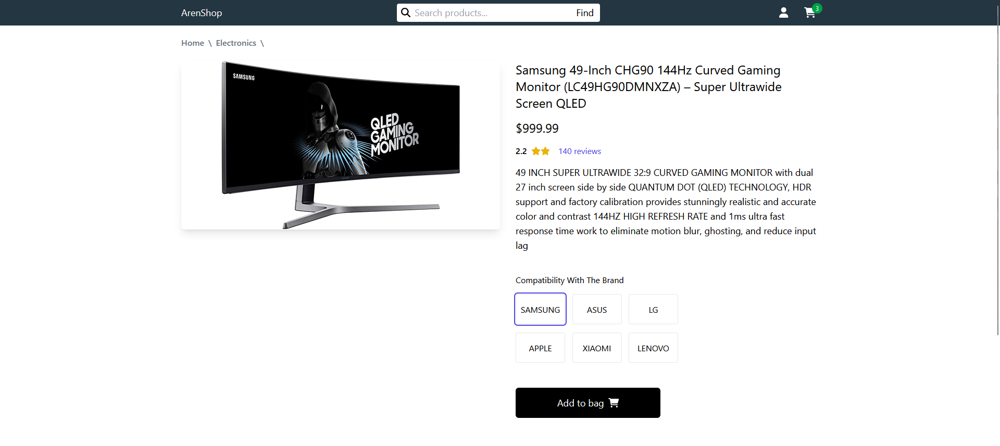
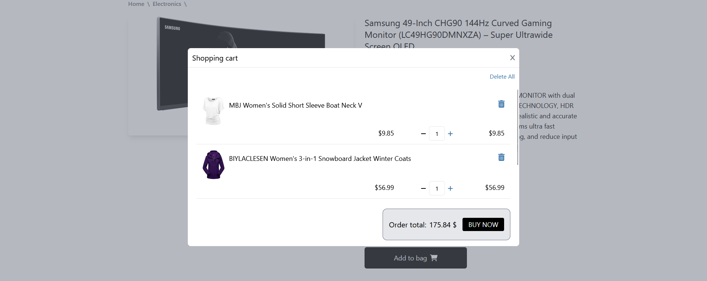

<h2>ArenShop Template</h2>
<p>💵A store website developed using ReactJS, HTML, and CSS, adhering to all coding principles and incorporating distinctive features for enhanced functionality.</p>

## Getting Started

Install the template packages via the code below:

```bash
npm install
```

And then run the project with the following code:

```bash
npm start
```

<br>

<p>💪This website features a variety of products, which can be explored using a category-based search filter for easy navigation:</p>

<br>
<p>🌝In this section, you can view comprehensive product details, including the name, price, and description, ensuring an informative browsing experience:</p>

<br>
<p>This section of the shopping cart displays all added products, allowing users to review and modify their selections effortlessly:</p>

<br>
<p>Finally, I would be delighted if you could rate the project❤️</p>
